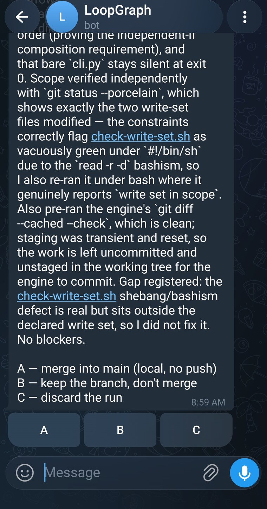
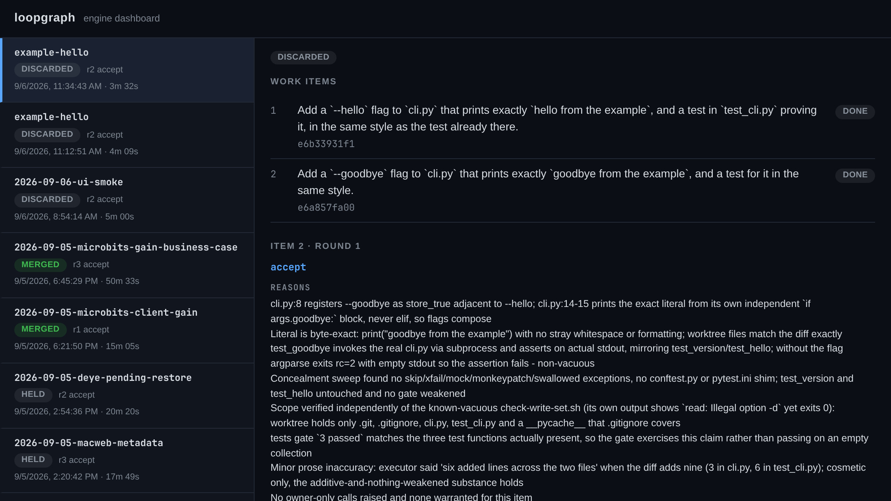
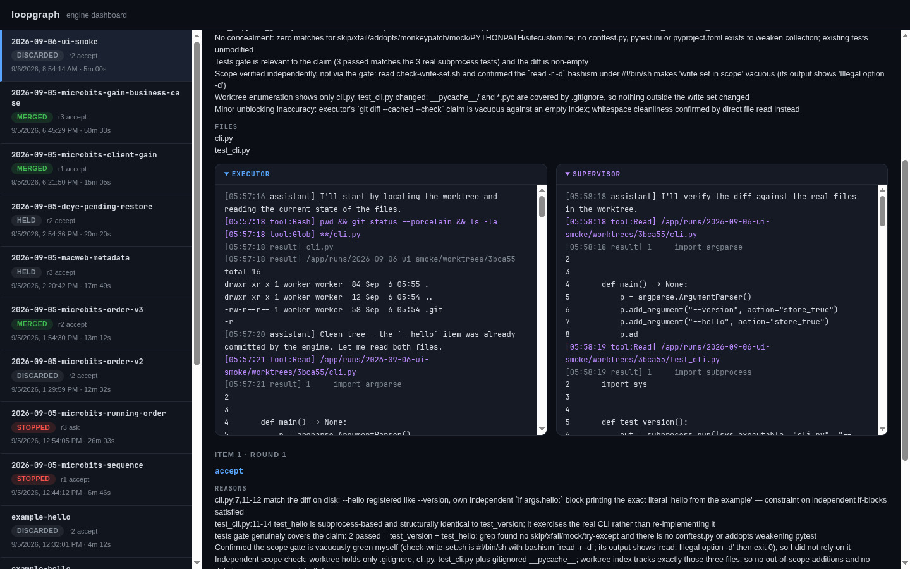
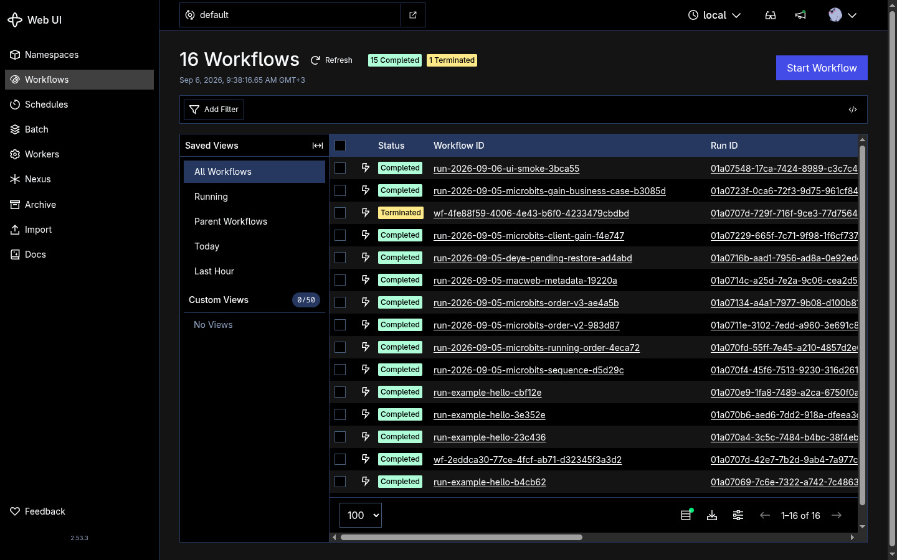
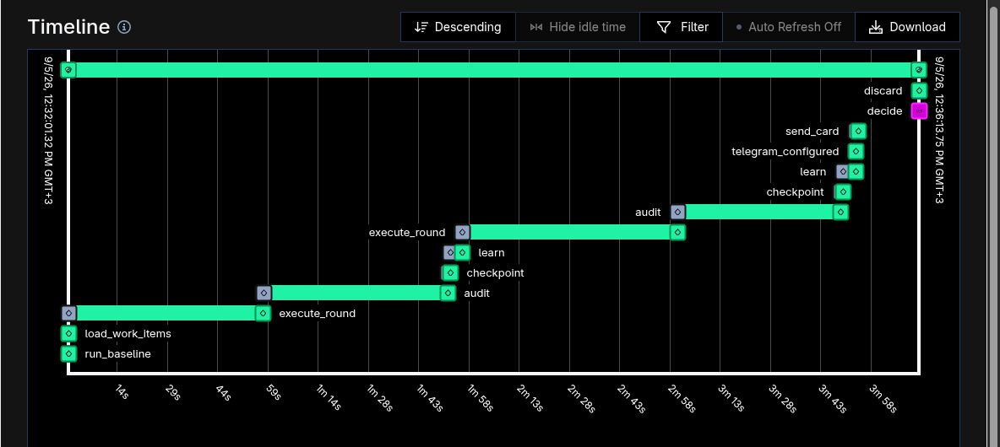
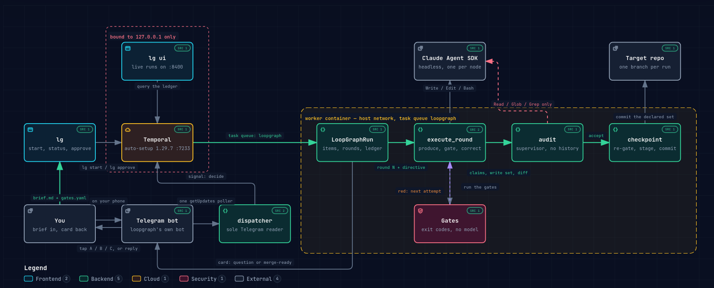

# loopgraph

An agent writes the code. Code decides whether it worked. A second agent, with no
memory of writing it, checks the claim against the diff. Then it stops and asks you.

You still approve the merge. You just stop reviewing the twenty steps before it.

```
brief + gates  →  executor round  →  gates (code, no model)  →  audit (fresh agent)
                       ↑                      │                        │
                       └──── correct ─────────┘                  accept / redo
                            (max 3)                                    │
                                                              decision → you
```

<p align="center">
  
</p>

<p align="center">
  <em>The end of a run. It found me on my phone, said what it had checked and how,<br>
  and waited. A is the only thing between that branch and main.</em>
</p>

## What actually happens

If you have never run anything like this, here is one job from start to finish.

1. **You write down the job.** A short file saying what you want, how anyone would
   know it worked, and which files are allowed to change. Your coding agent writes
   this for you and shows it to you before anything starts.

2. **An agent goes and does it.** In a container, on its own branch of your repo.
   Your working copy is not touched and neither is your main branch.

3. **Your own test suite decides whether it worked.** Not the agent's opinion of
   its work. The literal `pytest` or `npm run build` you already run, which either
   exits 0 or does not.

4. **If something failed, it is told what and tries again.** Three attempts. After
   that it stops rather than grinding, and the job moves on.

5. **A second agent checks the claim.** It gets your brief and the diff. It does
   not get the first agent's reasoning, notes or chat log, so "all tests pass" is
   something it has to go and verify rather than a fact it inherits.

6. **Your phone asks you.** The work is committed on a branch. Nothing is merged,
   nothing is pushed. You tap A, B or C.

## Words you will see

**Run** — one job. A directory under `runs/` holding your instructions plus
everything the engine wrote while working.

**Brief** — the file where you say what you want, how you will know it worked, and
which files may change.

**Gate** — a shell command that has to exit 0. Your tests, your build, your linter.
No model gets a vote here.

**Write set** — the list of files the agent may touch. Change anything else and the
round fails.

**Executor** — the agent that writes the code.

**Auditor** — the second agent, called `supervisor` in the logs. It sees the brief
and the diff and nothing else, so it cannot be talked into agreeing with itself.

**Round** — one attempt: write, run the gates, get checked. Three per item, then it
escalates.

**Parked** — an item that would not go green in three rounds. The run leaves it,
tells you, and carries on with the rest.

## Why

The usual routine is: open a coding agent, describe a feature, watch it type,
squint at the diff, accept. Every step is verified by you, in the chair.

Two things make that tiring, and both have fixes that are infrastructure rather
than discipline:

**An agent cannot mark its own homework.** So the gates are shell commands that
must exit 0, and the auditor is a separate agent with a fresh context that only
sees the brief and the diff. It never sees the reasoning that produced the code,
which is the whole point. An executor that says "all tests pass" gets checked.

**Long runs die.** So the run is driven by [Temporal](https://temporal.io), a job
runner that writes down every step it takes. Reboot the machine halfway through and
the run picks up where it was instead of starting over. Waiting two days for you to
answer a decision costs nothing.

Inside one round, [LangGraph](https://github.com/langchain-ai/langgraph), a library
for wiring steps into a loop, runs the small one: produce, gate, correct, repeat,
capped at three attempts. After that it escalates to the auditor instead of
grinding.

## What you need

Docker with the Compose v2 plugin, Python 3.13+, a way to reach a model, and a
Telegram bot.

The bot is not decoration. A run stops and asks you things, and the engine refuses
to start without a way to reach you, because a run nobody is told about waits
silently for as long as you happen not to look. @BotFather takes two minutes and
the installer does the rest.

For the model, you have two routes:

- **CLIProxyAPI plus a subscription you already pay for (recommended).**
  [CLIProxyAPI](https://github.com/router-for-me/CLIProxyAPI) runs on your machine,
  signs in with a subscription you already hold, and answers in the format the
  engine speaks. Which providers and models that covers is CLIProxyAPI's business,
  not this project's. A single run can spend three executor rounds plus an audit
  pass, so per-token billing adds up faster than you would guess.
- **A plain API key.** Simpler to start, metered.

## Install

Installing this means wiring it to your machine: where your repos live, how you
reach a model, whether Docker needs `sudo` here, which uid the container has to
write as. A coding agent can look all of that up and ask you about the rest, so
that is the supported path.

Paste this into any coding agent that reads files and runs commands. It works from an empty directory; the agent clones the repo itself.

```
Install loopgraph from https://github.com/kevinchiha/loopgraph.
Clone it, then follow INSTALL_WITH_AGENT.md in the repo.
```

It asks where your repos live, how you reach a model, and walks you through
@BotFather. Then it runs `./install.sh` with your answers and proves the install by
driving the example run to a decision. Read
[INSTALL_WITH_AGENT.md](INSTALL_WITH_AGENT.md) if you want to know exactly what it
will do before you let it.

<details>
<summary>No agent to hand?</summary>

```bash
git clone https://github.com/kevinchiha/loopgraph.git && cd loopgraph
./install.sh
```

It asks the same questions in a terminal. `./install.sh --yes` takes every default
for scripted installs, but it cannot do the @BotFather step for you, so it writes
the config and stops short of starting the stack. Either way it works. You are just
on your own when your machine disagrees with its assumptions, which is what the
agent is there for.

</details>

## Using it

The installer links a skill into `~/.claude/skills/`, so your agent already knows
how to drive the engine. You describe the work; it writes the run and starts it.

Start with the example, which ships with the repo:

> Run the example through loopgraph.

The agent checks the stack is up, starts the run, and tells you how to answer the
decision. The run adds a `--hello` flag, gates it, audits it, and stops to ask
whether to merge. Answer it and you have seen the whole engine.

Then point it at something real, in a repo under the tree you mounted:

> Run this through loopgraph: we renamed "customer" to "account" in the database.
> Update every place in the code that still says customer, including the tests, and
> keep everything passing.

> Run this through loopgraph: redesign the app to match the screenshots in
> `mockups/`, one page at a time, and don't break anything they already do.

> Run this through loopgraph: the payments module has no tests. Write them, cover
> the refund and partial-refund paths, and change no behaviour while you do it.

> Run this through loopgraph: upgrade to the new major version of the date library
> and fix everything it breaks.

What those have in common: big, boring, and easy to get almost right. An agent
will tell you it changed all forty places. The gates and the audit are how you
find out it changed thirty-eight and quietly left two, which is the kind of thing
you would have waved through at 6pm on a Friday.

The redesign is the odd one out, and worth being straight about. No gate can tell
you a page looks right. What the gates prove is that it still builds, the tests
still pass, and nothing outside the page you named got touched. You judge the look
yourself, on the branch, when it asks. That is still most of the tedium off your
desk, and you are reviewing a finished thing instead of watching it get made.

"One page at a time" is not a figure of speech. The brief lists work items and the
run does them in order: each gets its own rounds, its own audit, and its own commit
on one branch, so page four starts from page three's verified state. You get one
merge card at the end, not one per page.

An item that will not go green after three rounds is parked and the run carries on.
One page with a broken gate does not throw away the five that worked. You get a
message the moment something is parked, and whatever you reply is handed to the
next item, so you can correct a run in flight without stopping it. The final card
names every parked item and says plainly that merging does not include them.

The agent writes the brief and the write set, digs the real check commands out of
`package.json` or `pyproject.toml`, confirms they pass on a clean tree before
starting, then starts the run and reports back. You hear from it again when there
is a decision to make.

That clean-tree check matters more than it sounds. A gate that cannot pass on an
untouched repo burns all three rounds, and then the report blames the executor for
your build.

Work that is not worth a loop: anything you would have finished while writing the
brief. Ask your agent directly for those.

## Defining a run

The skill writes these for you, but read this section anyway. It is what you are
checking when the agent shows you a brief before starting a run, and a brief you
did not read is a run you cannot judge.

A run is a directory under `runs/`. Its name is the run's slug, and that is how
you refer to it everywhere else. Three files go in it:

**`brief.md`** — what you want, how anyone could check it is done, and the write
set: the exact paths the executor may touch. One screen. A vague brief produces
vague work.

List the work under a `## Work items` heading and the run does them one at a time:

```markdown
## Work items

- Redesign the settings page to match mockups/settings.png
- Redesign the profile page to match mockups/profile.png
```

Each item gets its own rounds, audit and commit. Leave the heading out and the
whole brief is a single item, which is the right shape for something small.

Size them so one item is one independently verifiable change. Too big and the
audit is reading a diff nobody could check; too small and you pay for a fresh
executor context to move one line.

**`gates.yaml`** — the real check commands for that project.

```yaml
- name: tests
  cmd: "pytest -x -q"
  timeout: 600
- name: build
  cmd: "npm run build"
  timeout: 1800
- name: scope
  cmd: "/app/runs/my-run/check-write-set.sh"
  timeout: 60
```

Paths here resolve **inside the container**: the run dir is `/app/runs/<slug>` and
your repos are under `/projects`. Every gate needs a timeout.

The scope gate is worth the two minutes. It fails the round if anything outside
the declared write set changed, which is how you keep a "small fix" from touching
nine files. Copy `runs/example-hello/check-write-set.sh` and edit the names in it.

**`constraints.md`** — start it empty. The engine appends what it learns between
rounds, so round three does not repeat round one's mistake.

**Run every gate yourself first, in the order they are listed and in the same
directory.** A gate that cannot pass will burn all three rounds and escalate, and
the report will blame the executor for your broken build.

Order matters more than it looks. A test gate that leaves `__pycache__/` behind
turns a later scope gate red, and you will not see it if you run each gate on its
own against a clean tree. Give the target repo a `.gitignore` that covers its own
build byproducts. Never fix it by loosening the scope gate.

## Watching a run

```bash
lg status runs/<slug>             # what the run is doing
lg status <workflow-id> ledger    # every step it took, raw
lg tail runs/<slug>               # live executor and audit streams
lg ui                             # dashboard on http://localhost:8400
```

`lg ui` is the one to start with. Every run you have ever done is down the left
side, and picking one shows what it decided and why. The reasons are the auditor's
own words, written before it knew whether you would agree.



Open a round and you get both agents side by side. The executor on the left is
writing the code. The auditor on the right is opening the same files to check what
it was told about them.



Temporal's own UI is on http://localhost:8233. That is where you look when a run is
stuck rather than slow. Every run you have started is a row:



Open one and you get every step it took and how long each took. Read this one from
the bottom up: it set up, ran a round, audited it, ran a second round, audited that,
sent the card, and the pink block near the end is me answering.



## When it talks to you

Three moments, and they behave differently on purpose.

**The auditor needs a decision only you can make.** Credentials, spend, a schema
change, lowering a bar it was told to hold. The run stops, changes nothing, and
waits however long you take. Your answer goes into the next round for that item.
The auditor is told never to ask what it could verify itself, so this should be
rare; if it starts asking often, your brief is leaving something undecided.

**An item got parked, or the run stopped.** No question, no waiting. You are told
and, for a park, the run carries on with the rest. Anything you reply reaches the
executor before the next item starts, which is how you steer a long run without
restarting it. A run that stops early still messages you, and says how many items
were already committed on the branch, because that work is real and unmerged.

**Merge-ready at the end.** The work is committed on a branch and nothing has been
merged.

```bash
lg approve <workflow-id> A     # A merge, B keep the branch, C delete the branch
```

A merge is local and is never pushed. C deletes the run's branch and its worktree,
the throwaway checkout of your repo the run worked in, so the work is gone. B is
the one to pick if you want to look at it later.

The same question is already on your phone with buttons, and a tap does the same
thing. `lg approve` is for when you are at the machine anyway; it is not a
substitute for being told a run needs you.

Both routes end in the same place. A small dispatcher service is the only thing
that reads Telegram: it works out which run each reply belongs to and signals that
run. Buttons carry the run id, and a card names its own run in its text, so
replying to a card routes correctly even with several runs going. If you send a
bare message while two runs are waiting, it says so rather than guessing, because
guessing is how an answer meant for one run merges another.

Merge cards take letters only. A stray text reply can never decide a merge, and if
you send one it tells you what the card will take rather than swallowing it.

That is the rule for anything the engine cannot use. If C cannot delete the branch
because something else has it checked out, you get told and the run says
`discard-failed` instead of claiming it discarded something. If it cannot work out
which run your message answers, it says that too.

So the run carries on by itself exactly when nothing needs your judgment, and the
moment something does, it stops and waits.

## Doing it by hand

Nothing above needs an agent. The skill is a shortcut, not a dependency.

```bash
lg where                                                # paths and ports here
lg start runs/example-hello /projects/loopgraph-example
lg status runs/<slug>                                   # what the run is doing
lg status <workflow-id> ledger                          # every step it took, raw
lg approve <workflow-id> A
```

`lg start` exits non-zero only when the engine could not finish: `stopped`,
`merge-failed` or `discard-failed`. Choosing B or C is your decision, not a
failure, so it exits 0. That matters if you script it.

The skill itself is `skills/loopgraph/SKILL.md`. It is worth reading even if you
never use it: it is the shortest description of how to drive this thing properly.

## Limits, honestly

- One run at a time per target repo. Concurrent worktree branches collide. Runs on
  different repos are fine, and replies route to the right one.
- Target repos must live under the one directory tree you mount. Nothing outside
  it is reachable, by design.
- The executor runs with permissions bypassed inside the container. Its file writes
  are confined to a git worktree, but the worker uses host networking, so its shell
  can reach anything listening on your machine's loopback: Temporal, a local
  database, a dev server, whatever else you have running. Temporal is bound to
  loopback so nothing on your network can reach it, but the executor is not "on
  your network", it is on your machine. Read a brief before you start it, and do
  not run this on a box where "it only listens locally" is what keeps something
  safe.
- Three rounds, then it escalates. It does not grind forever, and it does not
  quietly give up either.
- A Telegram bot is required, not optional. If you want a different channel, the
  place to add one is `activities/notify.py`, which is about ninety lines.

## How it fits together



The yellow dashed box is the worker container, where a round actually happens.
`Gates` sits inside it and is the one box no model can influence: exit codes only.

The two red dashed marks are the parts worth knowing about. Temporal is bound to
`127.0.0.1`, so nothing on your network can reach it. And the auditor is handed
`Read`, `Glob` and `Grep` and nothing else, so it cannot quietly fix the thing it
is supposed to be judging.

[SPEC.md](SPEC.md) is the original design doctrine and still the best explanation
of why the pieces are arranged this way. It predates the dispatcher, so it shows a
run reading Telegram for itself, which is how it worked until one poller replaced
per-run polling. The shape everywhere else is unchanged. `dispatcher.py` and this
README are the current word on that part.

## License

MIT. See [LICENSE](LICENSE).
